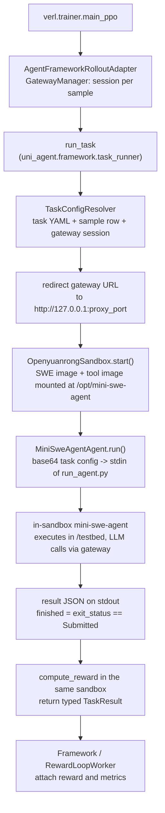

# Mini-SWE-Agent In-Sandbox Training Recipe

Train a policy to drive the real [mini-swe-agent](https://github.com/SWE-agent/mini-swe-agent)
on SWE-bench / SWE-reBench tasks. mini-swe-agent runs **inside** the task sandbox
from a sidecar tool image, calls the LLM policy through the gateway (via a reverse
tunnel when the sandbox is remote), and the reward is evaluated in the same sandbox.
The whole pipeline is wired into verl's black-box framework — no custom rollouter
code required.

## How it works



Per sample, `uni_agent.framework.task_runner.run_task`:

1. **Resolve** the task config (per-task YAML defaults + sample row + gateway session binding).
2. **Connect** to the gateway: the gateway URL is redirected to the sandbox-internal
   `127.0.0.1:<proxy_port>` (reverse tunnel), so the sandbox reaches the policy
   through the tunnel without needing to reach the training cluster directly.
3. **Run** mini-swe-agent inside the sandbox: the task config is piped (base64) into the
   tool-image python, which runs the real mini-swe-agent against `/testbed` and the policy.
4. **Score** in the same sandbox and return the reward in `TaskResult`; the
   Framework passes it through the configured RewardLoop scorer and attaches the
   resulting reward and metrics to the finalized trajectory. An episode counts as
   finished only when the agent actually submits a patch (`exit_status ==
   "Submitted"`), so unfinished ones are masked from the loss.

### Sandbox provider

This recipe runs on the **openyuanrong** sandbox — the only provider with
reverse-tunnel support. The tunnel carries the sandbox → policy direction, so the
sandbox cluster and the training cluster do **not** need to reach each other: only
the training side must access the sandbox service (API + image pull), which is the
typical setup for NPU clusters behind NAT.

## Prerequisites

| # | Requirement | Notes |
|---|---|---|
| 1 | **`verl` on `release/v0.9.0`** + `uni_agent` installed | from the repo root: `git -C verl fetch origin release/v0.9.0 && git -C verl checkout -q origin/release/v0.9.0`, then `pip install --no-deps -e ./verl && pip install -e .` |
| 2 | **OpenYuanrong sandbox account** | set `OPENYUANRONG_SERVER_ADDRESS` and `OPENYUANRONG_TOKEN` (see [Configuration](#training-script-env-vars)) |
| 3 | **Tool image built & reachable by the sandbox service** | see [Build the tool image](#1-build-the-tool-image); push to a registry the sandbox service can pull from |
| 4 | **Preprocessed dataset** | see [Prepare data](#2-prepare-data) |
| 5 | **A policy model** | any path/`hf://` ref accepted by the vLLM engine (`MODEL_PATH`) |
| 6 | **Multi-node NPU/GPU cluster** | the script starts Ray with `NPU` resources by default; GPU users switch the `ray start` flags (see `run_train.sh`) |

> This recipe is developed and validated against verl **`release/v0.9.0`**
> (`separate_async` trainer mode + the black-box agent framework). Older verl
> versions (e.g. `v0.8.x`) are not supported and may fail on trainer config or
> API compatibility.

## Quick start

### 1. Build the tool image

The tool image is a self-contained Python 3.12 runtime
([python-build-standalone](https://github.com/astral-sh/python-build-standalone))
with pinned `mini-swe-agent` + `litellm` + `run_agent.py`, packaged into a minimal
`FROM scratch` final stage. It is **mounted** into the sandbox at
`/opt/mini-swe-agent`, so the sandbox base image needs no Python.

```bash
# Local build (default PyPI source).
bash examples/mini_swe_agent/build_tool.sh

# Build behind a PyPI mirror.
bash examples/mini_swe_agent/build_tool.sh \
    --pip-index https://pypi.tuna.tsinghua.edu.cn/simple/

# Build, tag for the remote registry, and push.
bash examples/mini_swe_agent/build_tool.sh \
    --registry swr.cn-east-3.myhuaweicloud.com/openyuanrong
```

> The image URL is referenced from `task_config_mini_swe_agent.yaml`
> (`sandbox.sandbox_kwargs.mounts[].image_url`), **not** from the training script.
> If the sandbox service cannot pull it, change that URL (or push to a registry it
> can reach) and keep the two in sync.

### 2. Prepare data

Re-run the preprocessors so each parquet row carries the task payload consumed by
`run_task` (`extra_info.tools_kwargs.task` with `{name, sandbox:{image: canonical}, prompt, metadata}`):

```bash
python -m uni_agent.tasks.swe_rebench.preprocess --local-save-dir ~/data/uni_agent
python -m uni_agent.tasks.swe_bench.preprocess    --local-save-dir ~/data/uni_agent
```

The row's `sandbox.image` is a **canonical** ref (e.g. `swebench/sweb.eval.x86_64.astropy__astropy-12907`).
The recipe's Task Config maps it to the openyuanrong registry at run time via
`sandbox.image_map` (edit the `to:` targets there to use a different registry);
refs that are already full addresses (e.g. the tool image) pass through unchanged.

### 3. Launch training

```bash
OPENYUANRONG_SERVER_ADDRESS="<server-address>" \
OPENYUANRONG_TOKEN="<token>" \
MODEL_PATH=~/models/Qwen3.5-9B \
TRAIN_DATA=~/data/uni_agent/swe_rebench_filtered.parquet \
VAL_DATA=~/data/uni_agent/swe_bench_verified.parquet \
bash examples/mini_swe_agent/run_train.sh
```

`run_train.sh` starts Ray if needed and submits a Megatron V1 training job in
`separate_async` mode (`TRAINER_MODE=separate_async`, separate train/rollout
clusters; entrypoint `python3 -m verl.trainer.main_ppo`) whose rollout is driven
by the unified bridge:

```text
agent_runners.task.runner_fqn = uni_agent.framework.task_runner.run_task
```

### 4. Monitor

- Per-session framework/task logs land under `AGENT_LOG_DIR` (default
  `/home/${USER}/uni_agent_logs`), one `step_<N>/<session-id>/` directory per session.
- Training checkpoints go to `CKPTS_DIR` (default
  `checkpoints/${PROJECT_NAME}/${EXPERIMENT_NAME}`).
- Optional rl-insight telemetry: set `RL_INSIGHT_SERVER_URL` to enable the
  `rl_insight` logger (disabled when empty).

## Configuration reference

### Task config (`task_config_mini_swe_agent.yaml`)

The single per-task source of truth for agent + sandbox knobs; tune it without
touching the training script:

| Key | Default | Description |
|-----|---------|-------------|
| `sandbox.image_map` | `swebench/**` → `swr.cn-east-3.myhuaweicloud.com/openyuanrong/swebench/**` (and `swerebench/**`) | Prefixes canonical SWE image refs with the sandbox registry; keeps `swebench/` / `swerebench/` and the source tag |
| `sandbox.sandbox_kwargs.mounts[].image_url` | `swr.cn-east-3.myhuaweicloud.com/openyuanrong/mini-swe-agent-tool:latest` | Sidecar tool image mounted at `/opt/mini-swe-agent` |
| `sandbox.sandbox_kwargs.proxy_port` | `38197` | Sandbox-internal reverse-tunnel port — **single source of truth** |
| `sandbox.sandbox_kwargs.cpu/memory/…` | provider defaults | Sandbox resource sizes (pass through to the openyuanrong SDK) |
| `agent.step_limit` | `100` | mini-swe-agent max agent steps |
| `agent.run_timeout` | `7200` | Max wall time (s) for the agent process in the sandbox |
| `agent.conda_env` | `testbed` | Conda env activated inside the sandbox before running the agent |
| `agent.tool_python` | — (required) | Tool-image python; bound to the Dockerfile layout (`/opt/mini-swe-agent/bin/python`) |
| `agent.run_agent_script` | — (required) | Tool-image entrypoint; bound to the Dockerfile layout (`/opt/mini-swe-agent/bin/run_agent.py`) |
| `eval_timeout` | `600` | Task-level per-sample reward-eval timeout (s) inside the sandbox (swe_bench / swe_rebench) |

> `agent.tool_python` / `agent.run_agent_script` are **required**: they name paths
> inside the prebuilt tool image and are tied to its Dockerfile layout. If you
> build a custom tool image, set them (and the mount in `sandbox_kwargs.mounts`)
> together.

Runtime-managed (do **not** set in the YAML): `sandbox.sandbox_kwargs.upstream`
(gateway `host:port`, derived from the session) and `agent.model.base_url` /
`api_key` / `model_name` (injected from the gateway session; `base_url` is
rewritten through the reverse tunnel when `proxy_port` is set).

### Training script env vars

**Required**

| Variable | Description |
|----------|-------------|
| `OPENYUANRONG_SERVER_ADDRESS` / `OPENYUANRONG_TOKEN` | OpenYuanrong sandbox credentials |
| `MODEL_PATH` | Policy model path (default `~/models/Qwen3.5-9B`) |
| `TRAIN_DATA` / `VAL_DATA` | Preprocessed parquet paths (defaults under `~/data/swe_agent/`) |

**Sandbox / reverse tunnel**

| Variable | Default | Description |
|----------|---------|-------------|
| `OPENYUANRONG_TUNNEL_SSL_VERIFY` | `0` | TLS verification for the sandbox reverse tunnel |
| `SANDBOX_NAME_PREFIX` | `mini-swe-` | Prefix for created sandbox names |

**Rollout / framework runner**

| Variable | Default | Description |
|----------|---------|-------------|
| `TASK_CONFIG` | `examples/mini_swe_agent/task_config_mini_swe_agent.yaml` | Task-config YAML |
| `GATEWAY_COUNT` | `8` | Gateway actors fronting the engine |
| `MAX_CONCURRENT_SESSIONS` | `256` | Max in-flight rollout sessions (runner cap) |
| `SESSION_TIMEOUT_SECONDS` | `1800` (recipe) / none (framework) | Framework cap per session; guards against runners that hang without raising |
| `NUM_AGENT_WORKERS` | `8` | Ray workers executing the runner |
| `SERVED_MODEL_NAME` | `basename ${MODEL_PATH}` | Model name served at the gateway |
| `TOOL_PARSER` | `qwen3_coder` | Gateway tool-call parser; must match the model chat template |
| `MASK_UNFINISHED_EPISODE` | `True` | Zero the loss mask for unfinished episodes |

**Model / data / trainer (selected)**

| Variable | Default | Description |
|----------|---------|-------------|
| `NNODES_TRAIN` / `N_GPUS_PER_NODE` | `4` / `8` | Trainer nodes / GPUs per node |
| `NNODES_ROLLOUT` / `ROLLOUT_NGPUS_PER_NODE` | `= NNODES_TRAIN` / `8` | Rollout nodes (defaults to trainer nodes) / GPUs per node |
| `TRAIN_TP` / `TRAIN_PP` / `TRAIN_CP` | `N_GPUS_PER_NODE` / `2` / `4` | Megatron parallelism |
| `ENGINE` | `vllm` | Rollout engine |
| `N` | `8` | Rollout samples per prompt |
| `PROMPT_LENGTH` / `RESPONSE_LENGTH` | `4096` / `131072` | Sequence length budget |
| `PPO_MINI_BATCH_SIZE` / `PPO_MICRO_BATCH_SIZE_PER_GPU` | `16` / `1` | Batch sizes |
| `TOTAL_EPOCHS` / `SAVE_FREQ` / `TEST_FREQ` | `10` / `10` / `10` | Training schedule |
| `TRAIN_BATCH_SIZE` / `VAL_BATCH_SIZE` | `64` / `500` | Data batch sizes |
| `TRAIN_MAX_SAMPLES` / `VAL_MAX_SAMPLES` | `-1` | Cap samples per split (`-1` = all) |
| `VAL_BEFORE_TRAIN` | `true` | Run validation before the first step |
| `CKPTS_DIR` | `checkpoints/${PROJECT_NAME}/${EXPERIMENT_NAME}` | Checkpoint root |

### How the time budgets relate

- `agent.step_limit` caps the number of agent turns.
- `agent.run_timeout` caps the in-sandbox agent process (per sample).
- `SESSION_TIMEOUT_SECONDS` caps the whole session at the framework level (a
  safety net for runners that hang without raising, e.g. an OOM-killed remote
  sandbox). It defaults to no cap; the recipe sets it to `1800` — sessions
  exceeding it are cancelled (the Ray task is `ray.cancel`-ed, then the session
  aborted) and the sample is dropped from the batch without stopping training.
  Raise it when legitimate episodes regularly run longer.
- Task-config `eval_timeout` caps only the reward evaluation (after the agent
  finishes; default `600`).

## Result semantics & reward masking

The agent reports `finished = (exit_status == "Submitted")` — only a real
submission counts. With `MASK_UNFINISHED_EPISODE=True` (default), errored /
timed-out / step-exceeded episodes get a zero loss mask instead of being trained
toward a zero reward.

## Troubleshooting

| Symptom | Likely cause / fix |
|---|---|
| `OPENYUANRONG_SERVER_ADDRESS and OPENYUANRONG_TOKEN ... must be set` | Credentials missing; export both before `run_train.sh` |
| Sandbox cannot pull the SWE image | The canonical ref is mapped by `sandbox.image_map` in the task YAML; edit the `to:` targets (or add a rule) so it points at the registry the sandbox service can reach |
| Sandbox cannot pull the **tool** image | `mounts[].image_url` in the task YAML must be a full, pullable address — push it with `build_tool.sh --registry <registry>` |
| Agent never reaches the policy / requests fail inside the sandbox | Reverse tunnel misconfigured: `proxy_port` must be set in `sandbox_kwargs` (single source of truth) and the provider must be `openyuanrong`; `run_task` injects `upstream` + rewrites `base_url` |
| `ValueError: ... supported only on 'openyuanrong' ...` | `proxy_port` configured on a non-Yuanrong sandbox provider — switch the provider or drop `proxy_port` |
| Sessions aborted at a round number | `SESSION_TIMEOUT_SECONDS` too low for your episode lengths (recipe default `1800`) — raise it when legitimate runs are being cut short |
| Every episode "unfinished" / loss mask all zeros | Agent errored before submitting: check `exit_status` in the task logs under `AGENT_LOG_DIR`; or set `MASK_UNFINISHED_EPISODE=False` while debugging |
| Gateway tool-call parsing errors | `TOOL_PARSER` (`qwen3_coder`) must match the model's chat template |
| `config.model.base_url is not set` | Agent run outside the framework with no runtime model binding — only happens on standalone use; keep `base_url` in the config then |

## Design notes

- `uni_agent/agents/mini_swe_agent/agent.py` is **tunnel-agnostic**: the reverse
  tunnel (including the gateway-URL → tunnel-address math) is owned by the
  framework glue (`uni_agent/framework/task_runner.py`); the sandbox provider
  only receives the resolved `upstream` / `proxy_port`.
- The stdin/stdout protocol and the tool image are reused unchanged from the
  original mini-swe-agent runner; only the host-side orchestration moved into
  `uni_agent` first-class APIs.
- The openyuanrong sandbox defaults (cpu/memory) were raised; override them
  per-recipe via `sandbox_kwargs` if your budget is tighter.
